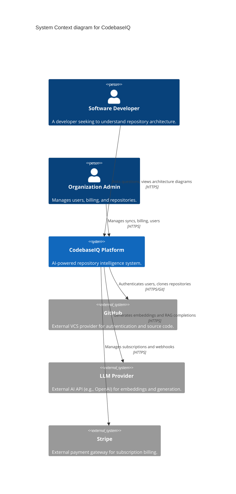
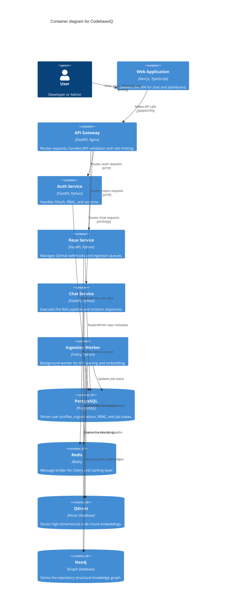
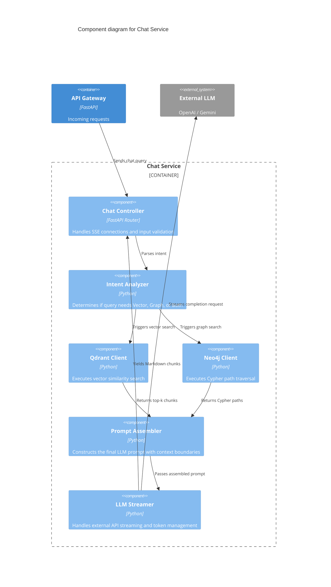
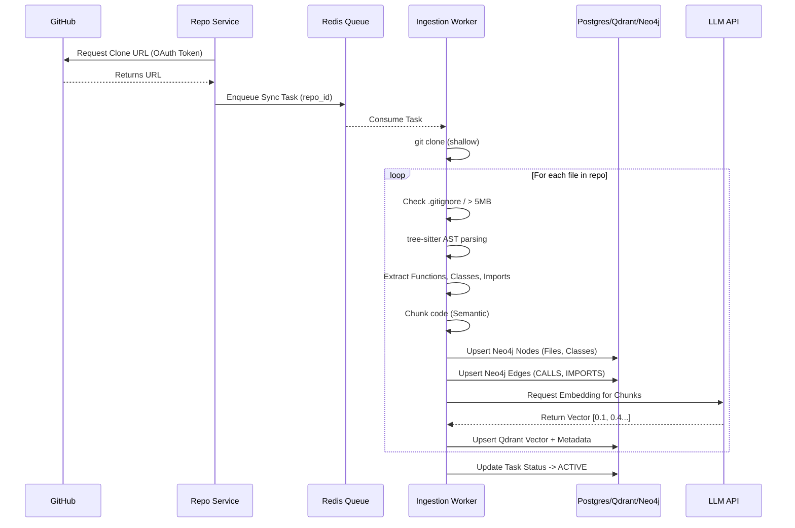
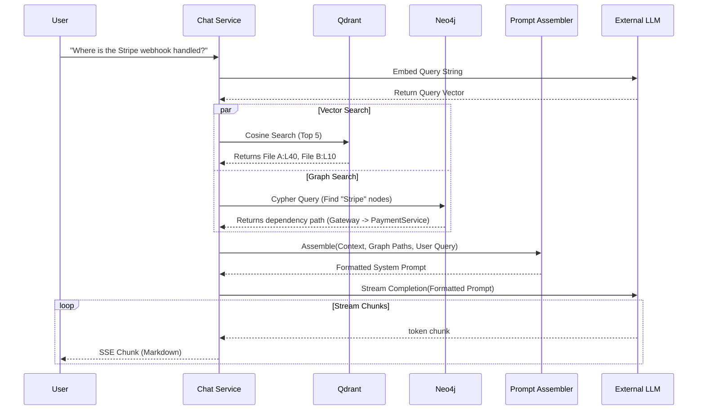

# 16 High-Level Design (HLD)

**Document Version:** 1.0
**Project Name:** CodebaseIQ - AI-Powered Repository Intelligence Platform

---

## 1. Introduction

This High-Level Design document outlines the macro-architecture of CodebaseIQ using the C4 Model (Context, Container, Component) and provides detailed data flow and pipeline architectures. The system is designed as a cloud-native, microservices-oriented platform deployed via Docker and Kubernetes.

---

## 2. C4 Model Diagrams

### 2.1 Context Diagram (Level 1)
This diagram illustrates how external actors interact with the CodebaseIQ system.

### 2.2 Container Diagram (Level 2)
This diagram zooms into the CodebaseIQ System to show the high-level containers (Microservices and Databases).

### 2.3 Component Diagram (Level 3 - Chat Service)
This diagram zooms into the `chat-service` to illustrate its internal components.

---

## 3. Deployment & Infrastructure Diagram

The system is deployed on a managed Kubernetes cluster (EKS/GKE) across multiple availability zones for high availability.

*(Note: The above uses Mermaid experimental architecture syntax. If rendering fails, fallback to a standard graph deployment diagram).*

---

## 4. Repository Processing Pipeline (Data Flow)

The data flow from a raw GitHub repository to actionable intelligence involves several distinct phases.

---

## 5. AI RAG Pipeline (Data Flow)

How the `chat-service` processes a user query.

