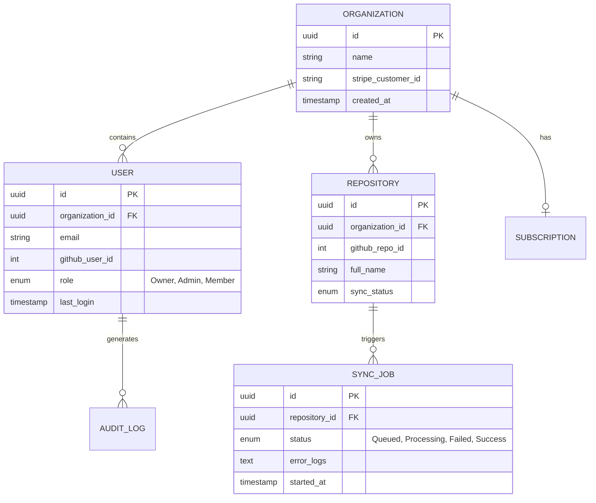

# 19 Database Design

**Document Version:** 1.0
**Project Name:** CodebaseIQ - AI-Powered Repository Intelligence Platform

---

## 1. Relational Database (PostgreSQL)

The source of truth for Identity, RBAC, Billing, and Metadata.

### 1.1 Entity-Relationship (ER) Overview


### 1.2 DDL & Indexing Strategy
*   **Multi-Tenancy:** All queries MUST include `organization_id` to leverage PostgreSQL Row-Level Security (RLS).
*   **Indexes:** B-Tree indexes created on `organization_id` (foreign keys) and `github_id` for fast lookups during OAuth and webhooks.

---

## 2. Vector Database (Qdrant)

Stores the high-dimensional embeddings for semantic search.

### 2.1 Collection Strategy
*   Instead of one massive collection, we use a single Qdrant Collection named `codebase_chunks` and rely on Qdrant's highly optimized **Payload Filtering**.

### 2.2 Vector Payload Definition
Every embedded code chunk stores the following payload metadata for strict RBAC filtering:
```json
{
  "organization_id": "uuid-1234",
  "repository_id": "uuid-5678",
  "file_path": "src/main/java/com/Auth.java",
  "chunk_type": "method",
  "start_line": 45,
  "end_line": 112,
  "raw_text": "public void login()..."
}
```
*   **Search Query:** `CosineSimilarity(QueryVector) WHERE organization_id = $org_id AND repository_id IN $repo_ids`.

---

## 3. Graph Database (Neo4j)

Stores the execution flow and structural architecture.

### 3.1 Graph Schema
*   **Nodes (Labels):**
    *   `:Repository` { id, name }
    *   `:File` { path, extension }
    *   `:Class` { name }
    *   `:Function` { name, signature }
*   **Relationships (Edges):**
    *   `(:Repository)-[:CONTAINS]->(:File)`
    *   `(:File)-[:DEFINES]->(:Class)`
    *   `(:Class)-[:HAS_METHOD]->(:Function)`
    *   `(:Function)-[:CALLS]->(:Function)`
    *   `(:File)-[:IMPORTS]->(:File)`

### 3.2 Graph Partitioning
To ensure strict multi-tenancy, every Node in Neo4j MUST have an `organization_id` property. All Cypher queries are automatically rewritten by the application layer to append `WHERE n.organization_id = $org_id`.

---

## 4. Cache & Message Broker (Redis)

*   **Message Broker (Celery):** `redis://localhost:6379/0` is used for asynchronous task queues (Ingestion, Garbage Collection).
*   **Session Cache:** `redis://localhost:6379/1` is used to store active JWT signatures and rate-limiting counters (Token Bucket algorithm).
