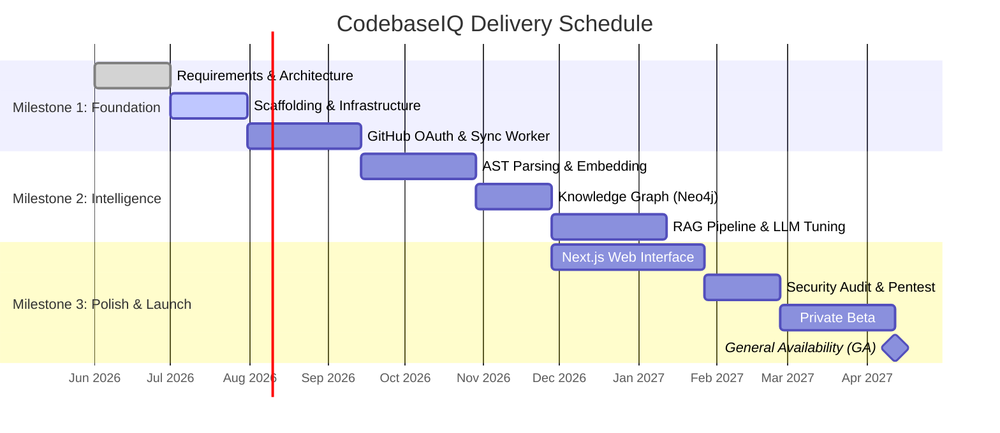

# Project Planning & Management

**Project Name:** CodebaseIQ - AI-Powered Repository Intelligence Platform  
**Document Number:** PM-001  
**Version:** 1.0.0  
**Date:** June 2026  
**Confidentiality:** Internal / Restricted  

---

## Document Control

### Version History
| Version | Date | Author | Description of Changes |
| :--- | :--- | :--- | :--- |
| 0.9.0 | 2026-06-27 | Technical PgM | Initial Delivery Schedule |
| 1.0.0 | 2026-06-28 | Executive Team | Final Roadmap Approval |

### Table of Contents
1.  Delivery Roadmap & Gantt Chart
2.  Epics & Sprint Backlog
3.  Resource Planning & RACI Matrix
4.  Risk Register

---

## 1. Delivery Roadmap & Gantt Chart

The project is estimated to take 12 months (52 weeks) to reach General Availability (V1.0) with a team of ~30 engineers. The work is divided into three primary milestones.

### 1.1 Mermaid Gantt Chart

## 2. Epics & Sprint Backlog

Development is managed in 2-week Agile sprints. Story points use the Fibonacci sequence (1, 2, 3, 5, 8, 13).

### 2.1 Initial Sprint Backlog (Sprint 1)
*   **[DEV-101]** Setup Terraform for AWS EKS Cluster (8 pts)
*   **[DEV-102]** Provision PostgreSQL and Redis via AWS RDS/ElastiCache (5 pts)
*   **[BE-103]** Scaffold FastAPI `api-gateway` with Clean Architecture (5 pts)
*   **[FE-104]** Initialize Next.js 14 project with Tailwind and Shadcn (3 pts)
*   **[BE-105]** Implement GitHub OAuth flow in `auth-service` (8 pts)

## 3. Resource Planning & RACI Matrix

### 3.1 Team Composition
*   1x Engineering Manager
*   1x Product Manager
*   1x UI/UX Designer
*   4x DevOps / SRE Engineers
*   8x Frontend Engineers (React/Next.js)
*   12x Backend/AI Engineers (Python, FastAPI, GraphDB)
*   3x QA Automation Engineers

### 3.2 RACI Matrix
| Deliverable | Product Manager | Engineering Mgr | Backend Lead | DevOps Lead | UI/UX Lead |
| :--- | :--- | :--- | :--- | :--- | :--- |
| **Requirements (PRD)** | **R, A** | C | I | I | C |
| **System Architecture (HLD)**| I | **A** | **R** | C | I |
| **Infrastructure Setup** | I | A | C | **R** | I |
| **Web Interface Build** | C | A | I | I | **R** |
| **Release to Production** | A | **R** | C | C | I |

*(R=Responsible, A=Accountable, C=Consulted, I=Informed)*

## 4. Risk Register

| Risk ID | Risk Description | Probability | Impact | Mitigation Plan |
| :--- | :--- | :--- | :--- | :--- |
| **RSK-01** | LLM API Costs scale non-linearly with repo size. | High | High | Implement strict token budgeting per Organization and semantic caching (Redis) for frequent queries. |
| **RSK-02** | `tree-sitter` fails to parse deeply nested legacy code. | Medium | Medium | Fallback mechanism to raw text chunking; flag files in UI as "degraded context". |
| **RSK-03** | Neo4j query latency spikes during complex path finding. | Low | High | Optimize Cypher queries; limit path depth traversal to 3 hops maximum for real-time chat. |
